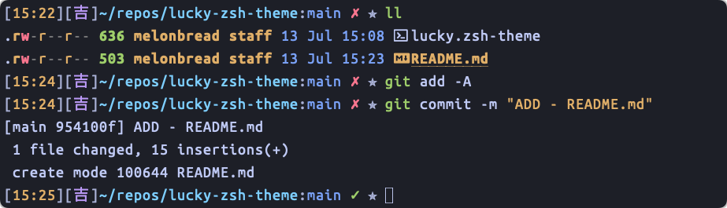

# lucky-zsh-theme
The word 吉 carry meaning of luck, what better place to have this lucky charm on your everyday zsh theme.

## Features
- shows the current time
- shows lucky charm 吉
- shows current dir
- shows Git branch
- shows Git status
- uses different colors for readability

## Installation
1. Write in your terminal `git clone https://github.com/MelonBreadVR/lucky-zsh-theme $ZSH_CUSTOM/themes/lucky-zsh-theme`
1. Open your `.zshrc`
1. Change your `ZSH_THEME` to `lucky-zsh-theme/lucky`
